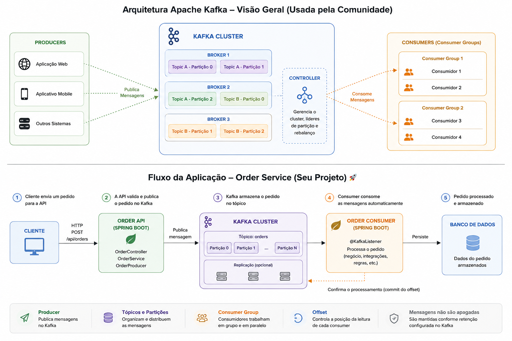
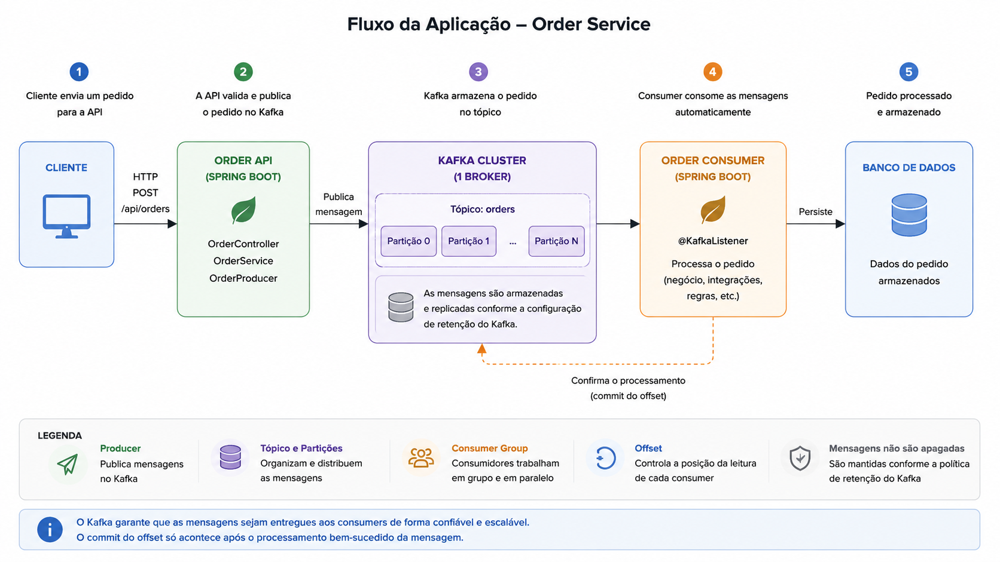

# 💳 Payment Microservice Java 21

**Java 21 + Spring WebFlux + Reactive Hexagonal Architecture + Kafka + PostgreSQL (R2DBC) / MongoDB Reactive + Non-blocking Async Processing**



## 🚀 Quick Start

### 1. Up the app infrastructure
```bash
docker compose up -d
```

### 2. Access Kafka UI / Management Console
[http://localhost:8282/](http://localhost:8282/)

---

## 🔄 App Flow (Order & Payment)




### 🧪 Send CURL to register order topic
```bash
curl --location 'http://localhost:8081/api/orders' \
--header 'Content-Type: application/json' \
--data '{
  "customerId": "user_amanda_1001",
  "totalAmount": 77.00,
  "cep": "04849270"
}'
```

---

## 📌 Project Overview

A production-inspired payment microservice built with **Java 21** and **Spring WebFlux**, demonstrating modern reactive backend development practices, **Hexagonal Architecture**, fully non-blocking I/O operations, and event-driven communication.

## 🚀 Key Highlights

* **Java 21**
* **Spring Boot 3 & Spring WebFlux** (Reactive Stack)
* **Hexagonal Architecture** (Ports & Adapters)
* **Apache Kafka** (Reactive Consumer / Event-Driven)
* **Spring WebClient** (Non-blocking HTTP Client)
* **Reactive Data Access** (R2DBC for PostgreSQL / Reactive Mongo Repositories)
* **Reactive Async Processing** (`Mono.zip` / `Flux` composition)
* **Virtual Threads & Project Reactor Integration**
* **Domain-Driven Design (DDD) principles**

---

## 🏗️ Architecture

The project follows **Hexagonal Architecture**, isolating domain models and business logic from reactive frameworks, databases, and external I/O adapters.

```text
                        ┌─────────────────────┐
                        │   Kafka Consumer    │
                        │  (Reactive Inbound) │
                        └──────────┬──────────┘
                                   │
                                   ▼
                        ┌─────────────────────┐
                        │      Use Case       │
                        │                     │
                        │   Create Payment    │
                        └──────────┬──────────┘
                                   │
         ┌─────────────────────────┼─────────────────────────┐
         ▼                         ▼                         ▼
    ViaCEP API                Economy API               Persistence
   (WebClient)               (WebClient)                   Port
         │                         │                         │
         ▼                         ▼                   ┌─────┴─────┐
      Address                   Currency               │           │
                                                   PostgreSQL    MongoDB
                                                    (R2DBC)     (Reactive)
```

---

## ⚡ Non-Blocking Reactive Processing

The payment flow triggers multiple independent external calls concurrently in a non-blocking execution model:

* **ViaCEP** — Fetch address details via non-blocking `WebClient`
* **AwesomeAPI** — Fetch USD/BRL exchange rate via non-blocking `WebClient`

Using **Spring WebFlux** (`Mono.zip`), external HTTP calls are dispatched reactively without thread blocking, ensuring high throughput, lower latency, and minimal resource utilization.

---

## 📨 Event-Driven Communication

Incoming orders are ingested reactively via **Apache Kafka**.

```text
Order Service
      │
      │ Kafka Event
      ▼
orders-topic
      │
      ▼
Payment Service (WebFlux Pipeline)
      │
      ├── ViaCEP (WebClient - Mono)
      │
      ├── Economy API (WebClient - Mono)
      │
      ▼
Payment Processing
      │
      ├── PostgreSQL (R2DBC Reactive)
      └── MongoDB (Reactive Mongo Repository)
```

---

## 🔌 External Integrations

### ViaCEP
Non-blocking lookup for customer address details based on ZIP code using `WebClient`.

### AwesomeAPI
Non-blocking lookup for real-time USD/BRL currency conversion rates using `WebClient`.

*Both integrations are fully decoupled behind **outbound ports**, preserving core domain independence.*

---

## 🧱 Project Structure

```text
src/main/java/com/github/celso_ricardo_bastos/payment_service/

├── domain/
│   ├── model/
│   └── exception/
│
├── ports/
│   ├── inbound/
│   └── outbound/
│
├── usecases/
│
└── adapters/
    ├── inbound/
    │   └── kafka/
    │
    └── outbound/
        ├── viacep/        # WebClient Outbound Adapter
        ├── economia/      # WebClient Outbound Adapter
        ├── postgres/      # R2DBC Reactive Adapter
        ├── mongo/         # Reactive Mongo Adapter
        └── kafka/
```

---

## 🛠️ Tech Stack

| Technology | Purpose |
| :--- | :--- |
| **Java 21** | Modern Java Features & Virtual Threads |
| **Spring WebFlux** | Reactive & Non-blocking Web Framework |
| **Spring WebClient** | Asynchronous HTTP Requests |
| **Apache Kafka** | Asynchronous Reactive Event Streaming |
| **PostgreSQL + R2DBC** | Reactive Relational Persistence |
| **MongoDB Reactive** | Reactive Document Persistence |
| **Docker & Compose** | Infrastructure & Containerization |
| **Maven** | Dependency Management |

---

## 🎯 Main Concepts Demonstrated

* Reactive Programming with **Project Reactor & WebFlux**
* **Hexagonal Architecture** with Reactive Pipelines
* **Non-blocking I/O Operations** across WebClient and Database Adapters
* Dependency Inversion and Clean Domain Isolation
* Event-Driven Architecture with **Apache Kafka**
* Reactive Concurrency Management (`Mono.zip`, `Flux`)
* Polyglot Persistence via Reactive Drivers (R2DBC & Reactive Mongo)

---

## ▶️ Running the Project

### Prerequisites
* **Java 21**
* **Maven**
* **Docker & Docker Compose**

### Steps

1. **Clone the repository:**
   ```bash
   git clone https://github.com/celsobastos/payment-service.git
   ```

2. **Navigate to the directory:**
   ```bash
   cd payment-service
   ```

3. **Start infrastructure containers:**
   ```bash
   docker compose up -d
   ```

4. **Run the reactive application:**
   ```bash
   ./mvnw spring-boot:run
   ```
   *On Windows:*
   ```bash
   mvnw.cmd spring-boot:run
   ```

---

## 👨‍💻 About

This project is part of my backend engineering portfolio, focusing on **Java 21, Reactive Programming (Spring WebFlux), Distributed Systems, Event-Driven Architectures, and Software Design Patterns**. 

The goal is to demonstrate how to build high-throughput, non-blocking backend services with robust architectural boundaries.